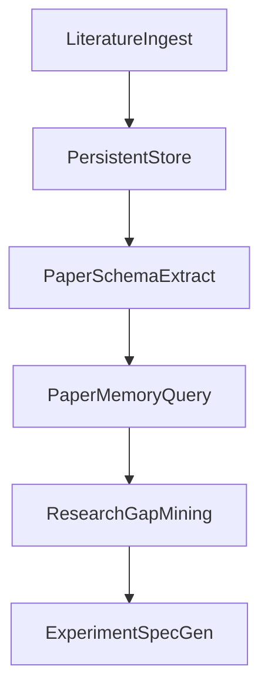

# AGENTS.md 与 Research Brain MVP 实施计划

## 现状对齐（与代码一致）

- **前端**：[src/](src/)（Vue 3 + TS + Pinia + Router），组件集中在 [src/components/](src/components/)。
- **后端**：[server/index.js](server/index.js)（HTTP：健康检查、知识库 CRUD、`/api/chat/stream`）；[server/mcp-server.js](server/mcp-server.js)（MCP 工具、内存向量 RAG、Qwen Embedding）。
- **缺口 relative to 需求**：论文无持久库；无 arXiv / Semantic Scholar / Scholar 拉取流水线；无 Paper Schema / Memory / Gap / Experiment Spec 的领域模型与 API；[`package.json`](package.json) 无 `test` 脚本。
- **注意**：[`README.md`](README.md) 中 `SERVER_PORT` 示例与 [`server/index.js`](server/index.js) 默认 `8787` 一致；实施时保持文档与默认值一致即可。

---

## 第一阶段（待你审核通过后执行）：新增 [AGENTS.md](AGENTS.md)

根目录单文件，结构固定为下列小节（正文保持短句、可执行，避免冗长规范）。

### 1. 代码风格与约束

- **命名**：TS/Vue 用 `camelCase`（变量/函数）、`PascalCase`（组件/类型）、文件名与现有一致（组件 `PascalCase.vue`，TS 模块 `camelCase.ts`）；服务端 JS 与现有 [server/](server/) 一致（函数 `camelCase`，常量 `camelCase` 或 `UPPER_SNAKE` 择一并与文件内统一）。
- **循环依赖**：不允许 package/module 级循环依赖；跨层调用单向（例如 `routes → services → repositories`，具体目录见下）。
- **导出**：Vue 组件默认 SFC；TS 优先命名导出；服务端沿用 ESM `import`/`export`（与 [server/index.js](server/index.js) 一致）。

### 2. 目录结构约定

- **稳定边界（不建议改名/打乱职责）**
  - [src/](src/)：`components/`、`composables/`、`services/`、`stores/`、`types/`、`main.ts`、`App.vue`、`styles.css`
  - [server/](server/)：`index.js`（HTTP 入口）、`mcp-server.js`（MCP 入口）
- **Research Brain 扩展（新增时放在此处，避免散落在根目录）**
  - `server/lib/` — 纯函数、客户端封装（期刊 API、PDF 路径解析等）
  - `server/services/` — 业务编排（ingest、extract schema、gap、spec）
  - `server/repositories/` — 持久化读写（见 MVP 数据层）
  - `server/schemas/` — Zod schema（与前端可共享的类型单独抽到 `src/types/research.ts` 如需）
  - `.agents/skills/` — 代理可复用技能（见下）
- **明确不写死**：允许在 `server/` 下继续拆分文件，但 HTTP 与 MCP 入口路径保持上述两个文件，便于运维与文档。

### 3. 运行与测试

- **启动**：`npm install` → 复制 `.env.example` 为 `.env.local` 并填写密钥 → `npm run dev`（并发客户端 + [server/index.js](server/index.js)）。
- **构建**：`npm run build`。
- **测试**：当前无自动化测试；约定后续新增 **`npm test`**（建议 Vitest + 对 `server/lib` 纯函数与 Zod schema 做快照/单测），在 AGENTS.md 中写「引入后即必须通过 CI/本地 `npm test`」，避免过度承诺具体框架版本（实施第二阶段再落依赖）。

### 4. 生成内容要求

- **命名**：迁移脚本 `YYYYMMDDHHmm_short_description` 或序号 `001_description`（选定一种写入 AGENTS.md）；一次性脚本放 `scripts/`。
- **注释语言**：代码注释与面向用户的错误文案与项目现状一致，**中文**为主；公开 API 或类型字段名保持 **英文**（与现有 `Citation`、`ChatMessage` 一致）。
- **示例**：仅当接口非显而易见时在 AGENTS.md 或对应 `README` 片段中给最小示例；不在业务代码堆长篇注释。

### 5. 提交规范

- **Commit message**：Conventional Commits 精简版，例如 `feat(research): add paper repository`、`fix(chat): sse error handling`。
- **分支**：`feat/<topic>`、`fix/<topic>`、`chore/<topic>`；禁止直接在 `main` 上堆积长期功能（若团队仅有本地 main，则至少使用功能分支合并习惯）。

### 6. 代理技能流程（写入 AGENTS.md 的 numbered 清单）

可执行步骤（与你给出的 7 条对齐，压缩表述）：

1. 接到任务先扫 **本地** [.agents/skills/](.agents/skills/) 是否已有匹配技能（每个技能目录至少包含 `SKILL.md`，可选脚本）。
2. 本地无时再检索 **GitHub 开源仓库** 与 **Skills.sh** 中与任务域匹配的技能。
3. 选型标准：**许可证清晰、README/SKILL 结构完整、无高危脚本（安装前粗审）**。
4. 安装路径固定：**`.agents/skills/<skill-name>/`**（`skill-name` 使用小写 kebab-case）。
5. 安装后在 **`.agents/README.md`**（若不存在则创建极简索引）增加一行：技能名、用途一句话、路径。
6. 仍无合适技能则直接实现；若解法可泛化，**事后**沉淀为新技能目录（同一规范）。
7. 避免重复克隆；定期删除试验性副本，保持目录只保留「真的会再用」的技能。

### 7. Harness（人机协作）约定（简短段落）

- 每个里程碑：**计划 → 你确认 → 实现 → 自测（build / 手工场景 / 后续 `npm test`）→ 你验收**。
- 默认 **不大范围重构** [server/mcp-server.js](server/mcp-server.js)；新域逻辑优先 `server/services/` + `server/lib/`，由入口逐步挂载。

**第一阶段交付物**：仅 [AGENTS.md](AGENTS.md)（及可选 [.agents/README.md](.agents/README.md) 占位索引）；**不改动业务代码**，除非你另行要求同步删改 [.env.example](.env.example) 中的敏感示例（当前含疑似真实 Key，建议在后续单独 PR 用占位符替换）。

---

## 第二阶段及以后：Research Brain MVP（分模块，每段可验收）

下列顺序兼顾依赖关系与可演示性；每阶段结束有可操作的验收清单。

### Phase R1 — 持久化与论文实体

- **目标**：满足「论文永久存储」；进程重启后知识库与论文元数据仍在。
- **建议**：SQLite（单文件）+ 本地目录存 PDF 原文；表：`papers`（元数据、外部 ID、文件路径）、`chunks`（paper_id、text、embedding 可 JSON 或 blob）、`paper_schema`（JSON）。
- **验收**：上传/导入一篇 PDF 后重启服务，列表与检索仍可用。
- **当前进度（已完成）**：已实现本地文件持久化（`.data/knowledge-state.json`）并在重启后自动恢复；下一步将该持久层演进为 SQLite repository，以支撑论文实体与结构化查询。

### Phase R2 — 文献 RAG（ingest）

- **目标**：从 **arXiv** + **Semantic Scholar API** 拉取元数据与 PDF（按合规速率）；入库并向量化；对话中可跨论文检索。
- **Google Scholar**：不作 MVP 硬依赖（反爬与 ToS 风险高）；AGENTS/PRD 中记为「后续：官方/第三方 API 或人工导入」。若你强制 MVP 包含，需在验收前单独确认数据源方案。
- **验收**：给定关键词/arxiv id，自动入库 ≥1 篇，RAG 返回答案并带引用片段。

### Phase R3 — Paper Schema 抽取

- **目标**：对每篇论文生成结构化卡片（你提供的 JSON 字段），经 Zod 校验后写入 `paper_schema`。
- **验收**：API 或 MCP 工具返回合法 schema；失败时有可重试/修复路径。

### Phase R4 — Paper Memory

- **目标**：基于已存储 schema 集合回答聚合问题（如「某任务上尝试过哪些方法及缺陷」）。
- **实现要点**：结构化检索 +（可选）向量摘要；响应中附 **论文 id / 标题** 追溯。
- **验收**：用 3+ 篇样例论文演示跨论文对比问答。

### Phase R5 — Research Gap Mining

- **目标**：输出研究机会列表（热点、少见变量、limitations 可利用）；每条机会关联引用论文。
- **验收**：输出列表字段稳定（建议定义 Zod：`opportunity`、`rationale`、`supportingPaperIds`）。

### Phase R6 — Experiment Spec Generator

- **目标**：从选定 gap 生成 Experiment Spec JSON（baseline、proposed_change、dataset、metrics、training_plan、ablation_plan）；**每条字段可追溯文献引用**。
- **验收**：单份 Spec 含 `citations` 或 `evidenceRefs`；可被下游「可选代码生成」消费（本 MVP 不实现自动跑实验）。

### Phase R7 — 前端最小集成（按需）

- **目标**：在现有 [KnowledgeBasePage.vue](src/components/KnowledgeBasePage.vue) / 路由上增加「导入 arXiv」「论文卡片」「Gap / Spec 视图」中的 **最小子集**（非全套重写）。
- **验收**：不走命令行即可完成一条完整演示链路。

### 测试策略（随 Phase R2+ 落地）

- 为 **Zod schema**、**引用对齐**、**repository** 添加 Vitest；HTTP 可对 `/api/health` 与关键 ingest 路由做轻量集成测试（可选）。

---

## 风险与决策点（实施前你可拍板）

| 话题 | 建议 |
|------|------|
| Google Scholar MVP | 默认跳过自动抓取；人工上传 + arXiv/S2 覆盖大部分场景 |
| 向量维度与迁移 | Embedding 模型变更时需重建索引；在持久层保留 `embedding_model` 字段 |
| MCP 与 HTTP 重复逻辑 | 抽取共享 `server/services`，两端 thin wrapper |

---

## 建议的执行顺序（Harness）

1. **你审核本计划 + AGENTS.md 大纲** → 批准后新增 [AGENTS.md](AGENTS.md)（及 [.agents/](.agents/) 索引）。
2. **Phase R1** 验收 → **R2** → … → **R7**。
3. 每阶段结束：`npm run build` + 约定测试 + 演示脚本/步骤写在 PR 描述或简短验收清单中。
